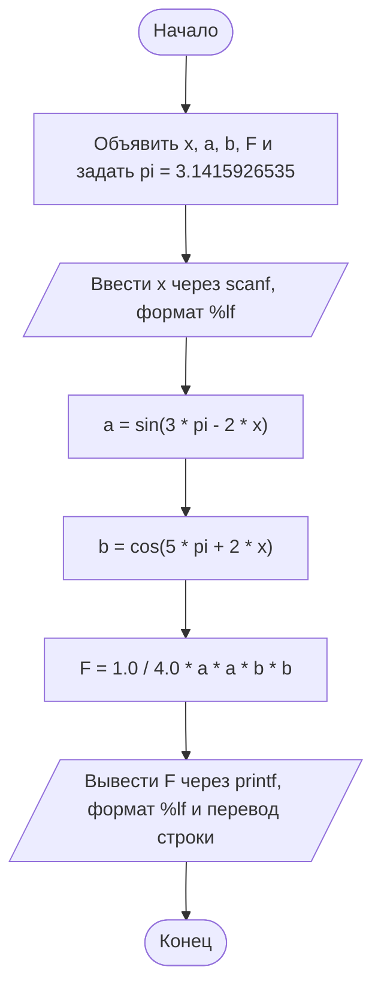

```mermaid
flowchart TD
    A([Начало]) --> B[Объявить x, a, b, F и задать pi = 3.1415926535]
    B --> C[/Ввести x через scanf, формат %lf/]
    C --> D["a = sin(3 * pi - 2 * x)"]
    D --> E["b = cos(5 * pi + 2 * x)"]
    E --> F["F = 1.0 / 4.0 * a * a * b * b"]
    F --> G[/Вывести F через printf, формат %lf и перевод строки/]
    G --> H([Конец])
```